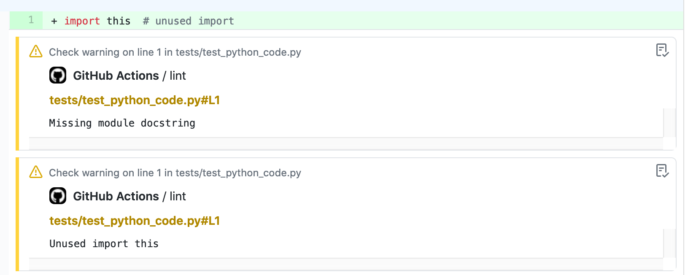

# python-lint-annotate

Zero-configuration GitHub Action to maintain code quality with push and PR annotations.

On every push and pull request git diffs will get inline annotated with found errors from
selected linters.



## Features

- Zero configuration based: Add a single line in your CI and done!
- GitHub Annotations on PR: Highlights issues inline on the PR diff.
- Most of the popular community trusted linters in one place.

## Linters supported

- [black](https://github.com/psf/black)
- [flake8](http://flake8.pycqa.org)
- [isort](https://github.com/timothycrosley/isort)
- [mypy](http://mypy-lang.org/)
- [pylint](https://www.pylint.org/)
- [pycodestyle](https://pycodestyle.readthedocs.io)
- [vulture](https://github.com/jendrikseipp/vulture)
- [pydocstyle](https://github.com/PyCQA/pydocstyle)

## Usage

Basic:

```yml
steps:
  - uses: actions/checkout@v1
  - uses: marian-code/python-lint-annotate@v2
```

Options:

```yml
steps:
  - uses: actions/checkout@v1
  - uses: marian-code/python-lint-annotate@v2
    with:
      python-root-list: "src/ tests/*"  # accepts wildcards
      use-pycodestyle: false
      use-mypy: false
      use-vulture: true
      extra-pylint-options: "--output-format="colorized"
      python-version: "3.7"
```

## Details

Uses `actions/setup-python@v2`. Only python `3.6` - `3.10` version are tested since
they are by far most common now. Other python `3.x` versions should also work.
Any python `2.x` versions are unsupported! You can lint on Linux, Windows and MacOS.

The lintner versions are:

```bash
pycodestyle==2.8.0  # from 3.5
pydocstyle==6.1.1
pylint==2.12.1
mypy==0.910
black==21.11b1
flake8==3.8.4
vulture==2.3
isort==isort-5.7.0
```

## IMPORTANT - test environment

The python version is set by `actions/setup-python@v2` using composite actions. This
means that the the action will change python you might have previously set with
`actions/setup-python@v2`. There are two ways to circumvent this.

- Keep the lintnig action separated from others
- Use it at the and of your workflow when the change in python version will not
   affect anything else

Example:

```yml
on:
  push:
  pull_request:
name: Lint Python
jobs:
  lintpython:
    name: Lint Python
    runs-on: ubuntu-latest
    steps:
    - uses: actions/checkout@v1
    - uses: actions/setup-python@v2
      with:
        python-version: 3.9
    - run: |
        python --version  # this will output 3.9 now
        run tests or other things using python ...
    - uses: marian-code/pyaction@v2
      with:
        python-root-list: "./tests/*.py"
        use-black: true
        use-isort: true
        use-mypy: true
        use-pycodestyle: true
        use-pydocstyle: true
        extra-pycodestyle-options: "--max-line-length=88"
        use-pylint: false
        use-flake8: false
        use-vulture: true
        python-version: "3.7"
    - run: |
        python --version  # this will output 3.7 now !!!
```

## License

The scripts and documentation in this project are released under the [MIT License](LICENSE)

## Contributions

Contributions are welcome through PRs.

## TODO

Wait until this is resolved: [PR646](https://github.com/actions/runner/issues/646)
so we can implement better python version control
